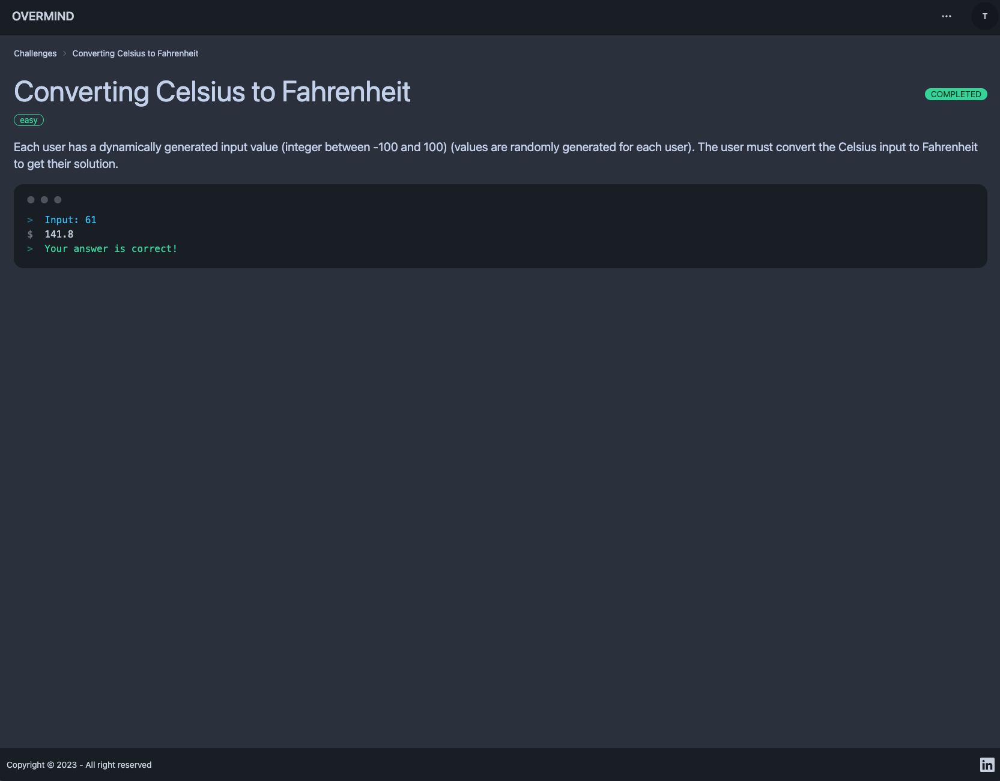

# Puzzle-Solving Platform

## Introduction

The challenge was to create a puzzle-solving platform that meets the stated requirements within a 72-hour timeframe. In this report, I discuss my design decisions, the tools I used, and what I accomplished. Additionally, I address the challenges I faced and what I would do if given more time.





## Architecture


## What's in the stack

- [Remix](https://remix.run/)
- [Multi-region Fly app deployment](https://fly.io/docs/reference/scaling/) with [Docker](https://www.docker.com/)
- [Multi-region Fly PostgreSQL Cluster](https://fly.io/docs/getting-started/multi-region-databases/)
- Healthcheck endpoint for [Fly backups region fallbacks](https://fly.io/docs/reference/configuration/#services-http_checks)
- [GitHub Actions](https://github.com/features/actions) for deploy on merge to production and staging environments
- Email/Password Authentication with [cookie-based sessions](https://remix.run/utils/sessions#creatememorysessionstorage)
- Database ORM with [Prisma](https://prisma.io)
- Styling with [Tailwind](https://tailwindcss.com/) and [DaisyUI](https://daisyui.com/)
- End-to-end testing with [Cypress](https://cypress.io)
- Local third party request mocking with [MSW](https://mswjs.io)
- Unit testing with [Vitest](https://vitest.dev) and [Testing Library](https://testing-library.com)
- Code formatting with [Prettier](https://prettier.io)
- Linting with [ESLint](https://eslint.org)
- Static Types with [TypeScript](https://typescriptlang.org)

### Rationale

RemixJS was chosen as the primary web framework for this project due to its focus on developer productivity, ease of use, and strong support for server-side rendering. It offers a robust set of features such as built-in support for sessions, easy integration with various databases and APIs, and an extensive library of UI components. Additionally, RemixJS provides excellent performance and security, making it an ideal choice for this puzzle-solving platform.

Last but not least, Remix is built on top of ReactJS, making it a breeze to integrate it with the React eco-system.

For authentication, I decided to use email/password authentication with cookie-based sessions provided by RemixJS's built-in session support. This approach offers a secure and straightforward way for users to authenticate and maintain their session state across different devices.

To interact with the database, I chose to use Prisma, a modern ORM that provides a type-safe and efficient way to query databases. It supports various databases, including PostgreSQL, which I used in this project.

I used Tailwind and DaisyUI for styling as they provide a comprehensive set of pre-built UI components that can be easily customized and extended to match requirements.

Even though testing was not required for this assignment, I used Cypress for end-to-end testing, Vitest and Testing Library for unit testing, and MSW for local third-party request mocking. These tools allows for testing the different components of the application thoroughly and catch potential issues early in the development process.

I used Prettier for code formatting and ESLint for linting to maintain a consistent code style and prevent common errors. Additionally, I leveraged TypeScript for static typing to catch type-related errors at compile time, which improved the overall code quality and maintainability of the project.

For deployment, I chose to use Fly.io with Docker for its multi-region capabilities and ease of scaling. Fly.io is a modern cloud platform that offers a global network of data centers to deploy and run applications with low latency and high availability. The app is not deployed though as requested in the assignment but in the event it needs to, it is easy to leverage Fly.io multi-region PostgreSQL cluster for storing and retrieving data as well as its healthcheck endpoint to ensure Fly backups region fallbacks.

To automate the deployment process, I opted to use GitHub Actions, a powerful and flexible CI/CD tool. This allows to quickly and efficiently deploy changes to production and staging environments with minimal downtime.

### Timeframe

I spent roughly 6 to 8 hours working on the project.

The first hours of work were spent in designing the models necessary to bring up the platform as well as defining the user workflows and sketching wireframes.

The time spent on the backend part was pretty equal to the time spent on the frontend part.

#### If I had more time

A few of my considerations are listing below:

- Code cleanup,
- Testing,
- Add additional features and improve current ones. Examples:
  - Calculate user ranking according the coding challenges completed,
  - Display an history of logs for the inputs of the user for each problem submitted or completed
  - Search feature allowing for retrieving puzzles or finding users,
  - Improve responsive design and come with a ludic way of solving puzzles for mobile users,
  - More gamifications, features to challenge other players
  - Chats between users for collaborations, etc
  - "Multi-player Mode"

## Development

- Clone the repository and change directory to the directory of the project:

  ```sh
  git clone git@github.com:TheodoreGC/overmind.git
  cd overmind/
  ```

- Install the dependencies:

  ```sh
  npm install
  ```

- Create an `.env` file:

  ```sh
  cp .env.example .env
  ```

- Start the Postgres Database in [Docker](https://www.docker.com/get-started):

  ```sh
  npm run docker
  ```

  > **Note:** The npm script will complete while Docker sets up the container in the background. Ensure that Docker has finished and your container is running before proceeding.

- Initial setup:

  ```sh
  npm run setup
  ```

- Run the first build:

  ```sh
  npm run build
  ```

- Start dev server:

  ```sh
  npm run dev
  ```

This starts your app in development mode, rebuilding assets on file changes.

The database seed script creates a new user with some data you can use to get started:

- Email: `theo@overmind.xyz`
- Password: `overmind`

### Relevant code

The main functionalities are signing up, logging in and out, taking part in solving multiple puzzles and submitting solutions.

- creating users, and logging in and out [./app/models/user.server.ts](./app/models/user.server.ts)
- user sessions, and verifying them [./app/session.server.ts](./app/session.server.ts)
- accessing blueprints for puzzles [./app/models/blueprint.server.ts](./app/models/blueprint.server.ts)
- creating and updating challenges for users and blueprints as well as saving logs of users' submissions [./app/models/challenge.server.ts](./app/models/challenge.server.ts)

I was able to develop a functional puzzle-solving platform that met all the requirements outlined in the challenge and beyond. The platform has the following features:

- Authentication: users can sign up, log in, and log out
- The Sum Challenge (Puzzle One): authenticated users can submit a solution, and each user has two dynamically generated input values. Individual puzzle pages account for different states.
- The Sorting Challenge (Puzzle Two): authenticated users can submit a solution, and each user has 500 randomly generated numbers to sort. The platform returns the integer in the 300th position. Individual puzzle pages account for different states.
- Public Profiles: each user has a public profile associated with /@username, where anyone can view the puzzles they have completed.

#### **Bonus**

- Converting Celsius to Fahrenheit (Puzzle Three): Each user has a dynamically generated input value (integer between -100 and 100) (values are randomly generated for each user). The user must convert the Celsius input to Fahrenheit to get their solution.
- Multiplying three integers (Puzzle Four): Each user has three dynamically generated input values (integer between 1-100) (values are randomly generated for each user). The user must multiply the input values to get their solution.
- Prime Triplet Sum (Puzzle Five): Find the sum of three prime numbers that add up to a given number. The three primes must be unique and in ascending order.

## Deployment

This project comes with two GitHub Actions that handle automatically deploying of the app to production and staging environments.

Prior to first deployment, you'll need to do a few things:

- [Install Fly](https://fly.io/docs/getting-started/installing-flyctl/)

- Sign up and log in to Fly

  ```sh
  fly auth signup
  ```

  > **Note:** If you have more than one Fly account, ensure that you are signed into the same account in the Fly CLI as you are in the browser. In your terminal, run `fly auth whoami` and ensure the email matches the Fly account signed into the browser.

- Create two apps on Fly, one for staging and one for production:

  ```sh
  fly apps create overmind-6b9f
  fly apps create overmind-6b9f-staging
  ```

  > **Note:** Once you've successfully created an app, double-check the `fly.toml` file to ensure that the `app` key is the name of the production app you created. This Stack [automatically appends a unique suffix at init](https://github.com/remix-run/blues-stack/blob/4c2f1af416b539187beb8126dd16f6bc38f47639/remix.init/index.js#L29) which may not match the apps you created on Fly. You will likely see [404 errors in your Github Actions CI logs](https://community.fly.io/t/404-failure-with-deployment-with-remix-blues-stack/4526/3) if you have this mismatch.

- Initialize Git.

  ```sh
  git init
  ```

- Create a new [GitHub Repository](https://repo.new), and then add it as the remote for your project. **Do not push your app yet!**

  ```sh
  git remote add origin <ORIGIN_URL>
  ```

- Add a `FLY_API_TOKEN` to your GitHub repo. To do this, go to your user settings on Fly and create a new [token](https://web.fly.io/user/personal_access_tokens/new), then add it to [your repo secrets](https://docs.github.com/en/actions/security-guides/encrypted-secrets) with the name `FLY_API_TOKEN`.

- Add a `SESSION_SECRET` to your fly app secrets, to do this you can run the following commands:

  ```sh
  fly secrets set SESSION_SECRET=$(openssl rand -hex 32) --app overmind-6b9f
  fly secrets set SESSION_SECRET=$(openssl rand -hex 32) --app overmind-6b9f-staging
  ```

  > **Note:** When creating the staging secret, you may get a warning from the Fly CLI that looks like this:
  >
  > ```sh
  > WARN app flag 'overmind-6b9f-staging' does not match app name in config file 'overmind-6b9f'
  > ```
  >
  > This simply means that the current directory contains a config that references the production app we created in the first step. Ignore this warning and proceed to create the secret.

  If you don't have openssl installed, you can also use [1password](https://1password.com/password-generator/) to generate a random secret, just replace `$(openssl rand -hex 32)` with the generated secret.

- Create a database for both your staging and production environments. Run the following:

  ```sh
  fly postgres create --name overmind-6b9f-db
  fly postgres attach --app overmind-6b9f overmind-6b9f-db

  fly postgres create --name overmind-6b9f-staging-db
  fly postgres attach --app overmind-6b9f-staging overmind-6b9f-staging-db
  ```

  > **Note:** You'll get the same warning for the same reason when attaching the staging database that you did in the `fly set secret` step above. No worries. Proceed!

Fly will take care of setting the `DATABASE_URL` secret for you.

Now that everything is set up you can commit and push your changes to your repo. Every commit to your `main` branch will trigger a deployment to your production environment, and every commit to your `dev` branch will trigger a deployment to your staging environment.

If you run into any issues deploying to Fly, make sure you've followed all of the steps above and if you have, then post as many details about your deployment (including your app name) to [the Fly support community](https://community.fly.io). They're normally pretty responsive over there and hopefully can help resolve any of your deployment issues and questions.

### Multi-region deploys

Once you have your site and database running in a single region, you can add more regions by following [Fly's Scaling](https://fly.io/docs/reference/scaling/) and [Multi-region PostgreSQL](https://fly.io/docs/getting-started/multi-region-databases/) docs.

Make certain to set a `PRIMARY_REGION` environment variable for your app. You can use `[env]` config in the `fly.toml` to set that to the region you want to use as the primary region for both your app and database.

#### Testing the app in other regions

Install the [ModHeader](https://modheader.com/) browser extension (or something similar) and use it to load your app with the header `fly-prefer-region` set to the region name you would like to test.

You can check the `x-fly-region` header on the response to know which region your request was handled by.

## GitHub Actions

I use GitHub Actions for continuous integration and deployment. Anything that gets into the `main` branch will be deployed to production after running tests/build/etc. Anything in the `dev` branch will be deployed to staging.

## Testing

### Cypress

I use Cypress for our End-to-End tests in this project. You'll find those in the `cypress` directory. As you make changes, add to an existing file or create a new file in the `cypress/e2e` directory to test your changes.

I use [`@testing-library/cypress`](https://testing-library.com/cypress) for selecting elements on the page semantically.

To run these tests in development, run `npm run test:e2e:dev` which will start the dev server for the app as well as the Cypress client. Make sure the database is running in docker as described above.

I have a utility for testing authenticated features without having to go through the login flow:

```ts
cy.login();
// you are now logged in as a new user
```

I also have a utility to auto-delete the user at the end of your test. Just make sure to add this in each test file:

```ts
afterEach(() => {
  cy.cleanupUser();
});
```

That way, I can keep the local db clean and keep the tests isolated from one another.

### Vitest

For lower level tests of utilities and individual components, I use `vitest`. There is DOM-specific assertion helpers via [`@testing-library/jest-dom`](https://testing-library.com/jest-dom).

### Type Checking

This project uses TypeScript. It's recommended to get TypeScript set up for your editor to get a really great in-editor experience with type checking and auto-complete. To run type checking across the whole project, run `npm run typecheck`.

### Linting

This project uses ESLint for linting. That is configured in `.eslintrc.js`.

### Formatting

I use [Prettier](https://prettier.io/) for auto-formatting in this project. It's recommended to install an editor plugin (like the [VSCode Prettier plugin](https://marketplace.visualstudio.com/items?itemName=esbenp.prettier-vscode)) to get auto-formatting on save. There's also a `npm run format` script you can run to format all files in the project.
